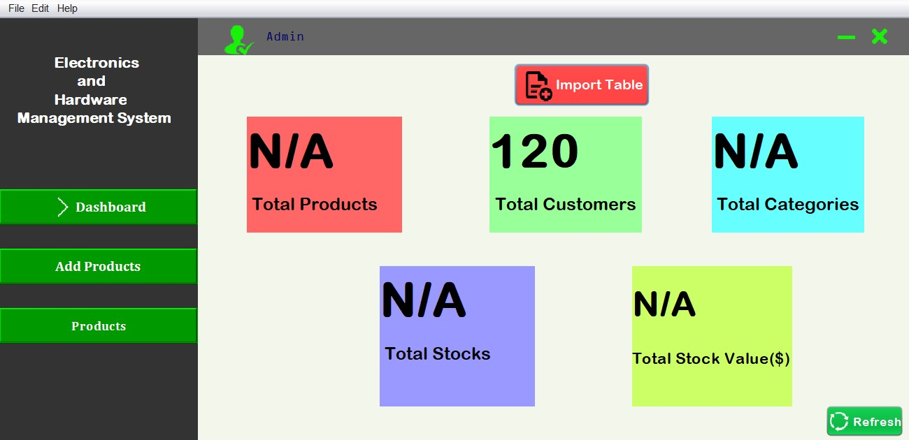

# Electronic-and-Hardware-Information-Management-System

This app is used to store information of various electronics and hardware tools in a tabular format. The concept of binary search, sorting, and file handling was used for the completion of app.

## Functionalities Used
- Binary Search
- Merge Sort
- Object-Oriented Programming
- File handling
- Functional programming

## IDE USED
- Apache Netbeans

## Screenshot of the app

